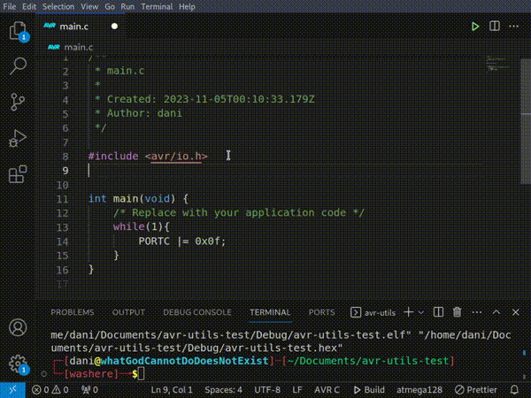
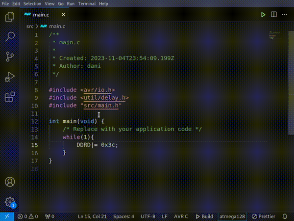

# avr-utils README

Welcome to **`avr-utils`**.

This extension helps users to write and compile code for their AVR microcontrollers straight from the comfort of their favorite code editor, **VSCode**.

```yaml
New Features:
- Progress bar when downloading toolchain.
- Better error message diagnostics (Big Improvement!)
- Simplified Commenting of code.
- Added Upload functionality. You can now upload the built hex or elf files straight to your microcontroller unit.
```

## Features

- ### Projects: Creating and Importing

  - #### >> Create Or Import

    

    > **You can create a new AVR project or import an existing project created from Microchip/Atmel Studio.**

    <p>After making a choice, VSCode will ask you to choose a folder.</p>

    - If opening a Microchip project, it asks for the project folder of your **existing project**.
    - If creating a new project, it asks for the folder to put the project in, then it asks for a **name** for the project (then asks for permission to load the project if you already have another project open in the editor).<br><br> 

  - #### >> No Toolchain?

    You may want to build the opened/newly created project, but you encounter a popup saying you have no toolchain.

    Don't worry, you just have to download a new toolchain (**you don’t have to have Microchip Studio**), or if you already have Microchip Studio on your device, you can choose to take time to locate the folder within the install directory of Microchip Studio which has the name "avr8-**" and contains the following folders, or at least 90% of them.

    <br>

    > Generally, I recommend downloading a new toolchain to save you the time.

    

  - #### >> Select a Device First

    

    Before running a successful build in **C**, you need to select a microcontroller so that **avr-gcc** does not give build errors.
    
    
    
    Once you build the project successfully, you will get a .elf file, a .hex file, and an .o file created for you within the Debug folder in your project.

    

    ---

- ### Code Completions

  - #### >> Toolchain Headers and Project Headers

    Within the "main.c" file or any other project file in **C**, you can get completions for the **avr-gcc** headers or the project-level headers.

    

  - #### >> Header Document Links

    You can easily open header files if you need to read documentation or edit them through the links provided as shown below.

    

- ### Object Definitions

  - #### >> Device Header Files

    After selecting a device, you can access its definitions like for registers such as DDRA or PORTA. If the device has a register, you can press Ctrl or Cmd and click the register variable using your pointer to get taken to the definition. If the register doesn’t exist on the selected device, you won’t get definitions.

    

    Of course, this works on variables and functions too.

  - #### >> Project Header Files

    Header files within the project directory can also contribute to the definitions. In general, any file that you "#include" will contribute to the definitions.

    

- ### Uploading to Microcontroller

  - #### >> Upload with Saved Programmer Settings

    The extension now supports uploading your compiled .hex file to an AVR microcontroller with enhanced usability features.

    - **Saved Settings**: After your first upload, the programmer type (e.g., usbasp), MCU (e.g., atmega16), and port (e.g., COM3) are saved in avr_project.json. On subsequent uploads, you’ll be prompted to either use the saved settings or change them, making repeated uploads faster.
    - **Dropdown Selections**: Instead of manually typing the programmer, MCU, and port, you can now select them from dropdown menus with common options and a "Custom..." fallback for flexibility. Each option includes a description (e.g., "Common USB programmer" for usbasp) to help you choose the right settings.
    - **Improved Reliability**: The upload process has been made more reliable, especially on Windows, by fixing path issues with avrdude. The extension now uses the correct path for avrdude (e.g., AVR Utils\toolchain\bin\avrdude.exe), adds .exe for Windows, and provides a fallback to a system-installed avrdude if the toolchain version is missing.

    To upload, press F5 or use the "Upload to Microcontroller" command from the command palette (Ctrl+Shift+P or Cmd+Shift+P, then type "AVR Utils: Upload to Microcontroller").

    > **Note**: Ensure avrdude.exe exists in AVR Utils\toolchain\bin (e.g., C:\Users\hp\Documents\AVR Utils\toolchain\bin\avrdude.exe on Windows). If it’s missing, the extension will prompt you to download the toolchain or use a system-installed avrdude.

<!-- ## Requirements If you have any requirements or dependencies, add a section describing those and how to install and configure them. -->

## Command Palette Contributions

The extension comes with some settings added to the command palette. Press Ctrl+Shift+P or Cmd+Shift+P and type "**AVR Utils**" to view them.

- Open Microchip Project: You can use this to open a project folder for a project created using Microchip Studio (a.k.a Atmel Studio).
- Create Project: This is used to create a new project. This command also creates some minimal boilerplate code in C to get you started.
- Build/Compile: This command only appears when the project has been opened and there is an active C file. <br>Take note that this command can also be invoked by pressing F4 on your keyboard, or by the Build button at the bottom of the VSCode window.
- Upload to Microcontroller: This command allows you to upload your compiled .hex file to an AVR microcontroller. It can be invoked by pressing F5 or via the command palette.

## Settings Contributions

The extension also now has some settings accessible from Ctrl+, or Cmd+,, then search for "**AVR Utils**":

- Show terminal at each build: This setting is useful to ensure that there are no build errors arising from your code since an extension cannot directly get stdout from the terminal to parse errors. You can turn this off in case you don’t need it.

## Known Issues

If you have the extension ms-vscode.cpptools installed, it will cause red squiggles in your code, plus it will create extra buttons in the UI which may not build your AVR.<br> Therefore, to solve this, I registered a new language called "AVR C" which handles the same file extension .c. If you need to use your IDE for normal C development, you can switch the language as shown below.


## Release Notes

Release notes section.

### 0.1.7

- Added programmer part with saved settings for uploading: programmer type, MCU, and port are saved in avr_project.json after each upload, with a prompt to reuse or change them.
- Added dropdowns for selecting programmer, MCU, and port, with descriptions for better usability.
- Fixed avrdude path issues on Windows by using the correct toolchain path, adding .exe handling, and providing a system-installed fallback.
- Improved error handling and debugging for the upload process with user prompts and debug logging.

### 0.0.3

- Changed README to use GIFs.
- Changed all video assets to GIFs.

### 0.0.2

- Better integration with Assembly language development.
- Code coloring following tmLanguage rules for both avr-c and asm/s.
- Published to VSCode Marketplace.

### 0.0.1

Initial release of avr-utils.
