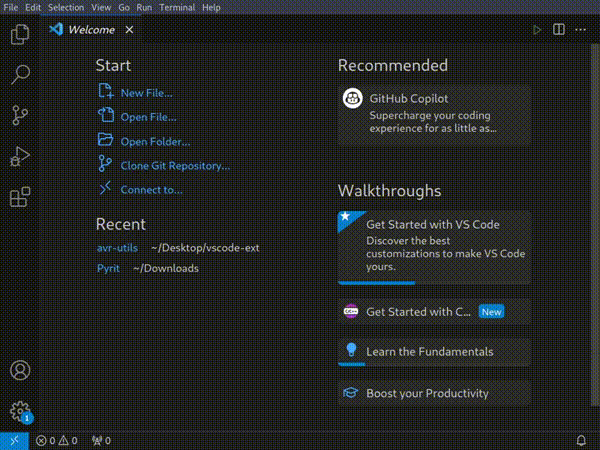
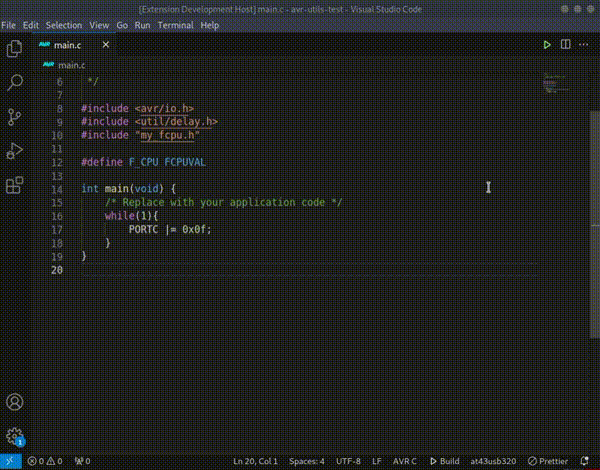
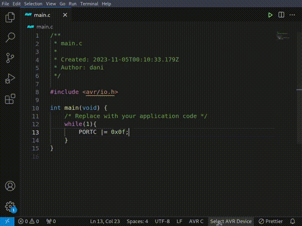
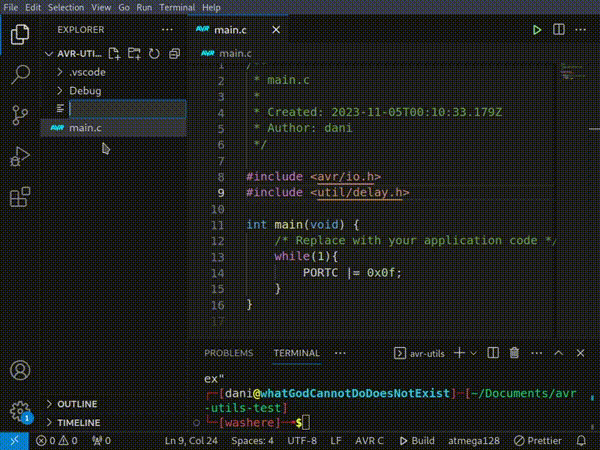

# avr-utils README

Welcome to **`avr-utils`**.

This extension helps users to write and compile code for their AVR microcontrollers straight from the comfort of their favorite code editor, **VSCode**.

```yaml
New Features:
- Progress bar when downloading toolchain.
- Better error message diagnostics (Big Improvement!)
- Simplified Commenting of code.
- Added Upload functionality: Upload .hex or .elf files directly to your AVR microcontroller.
- Automatic avrdude download for Windows, Linux, and macOS — with redirect handling and platform-specific archive support.
- Programmer type dropdown expanded: supports 13+ common avrdude programmer options.
```

---

## Features

### 🔧 Projects: Creating and Importing

- **Create or Import**  
  Easily create a new AVR project or import an existing one from Microchip/Atmel Studio.

  

  - Automatically prompts for folder and project name  
  - Supports importing `.atsln` or `.cproj` projects  
  - Fully offline toolchain support (recommended)  

  

- **No Toolchain? No Problem**  
  You’ll be prompted to either locate an existing toolchain (e.g., from Microchip Studio) or download one directly.

    
  

- **Select a Device First**  
  Pick your microcontroller before building — ensures proper header files are used.

    
    
  

---

### ⚡ Uploading to Microcontroller

#### >> Upload with Saved Programmer Settings and Auto-Download

The extension supports uploading your compiled `.hex` file to an AVR microcontroller with a smooth UX:

- ✅ **Saved Upload Settings**  
  After the first upload, settings like `programmer`, `mcu`, and `port` are saved to `.vscode/avr_project.json`. You’ll be prompted to reuse or reconfigure them next time.

- ✅ **Expanded Programmer Selection**  
  Choose from a comprehensive list of programmer types:

  ```
  usbasp, avrisp2, stk500v1, stk500v2, arduino, wiring,
  avrisp, usbtiny, dragon_isp, dragon_dw, jtag1, jtag2, pickit2, ponyser
  ```

- ✅ **Automatic avrdude Download**  
  - Downloads platform-specific avrdude (Windows, Linux, macOS) if missing  
  - Handles GitHub redirects  
  - Progress reporting during download  
  - Extracts to toolchain bin folder  
  - Grants executable permission on Unix systems automatically

- ✅ **Fallbacks & Robustness**  
  - Will fallback to system-installed `avrdude` if download skipped  
  - Verifies `avrdude` exists post-install  
  - All errors are logged for transparency

🔁 Use "Upload to Microcontroller" from the Command Palette or press `F5`.

> 💡 Make sure the compiled `.hex` exists inside your `Debug` folder.

---

### ✨ Code Completions & Definitions

- **Toolchain Headers**  
  Autocompletion works for all `avr/io.h` and other standard headers.

  

- **Header Links**  
  Clickable includes to quickly navigate your project files.

  

- **Register & Symbol Definitions**  
  Works for both MCU-defined symbols like `PORTB` and user-defined functions.

    
  

---

## ⚙ Command Palette Contributions

Press `Ctrl+Shift+P` or `Cmd+Shift+P` → Type **AVR Utils** to access:

- **Create Project**
- **Open Microchip Project**
- **Build/Compile** (also `F4`)
- **Upload to Microcontroller** (`F5`)

---

## 🧰 Settings Contributions

Search for **AVR Utils** in VSCode settings:

- **Show terminal at each build** – toggle to view/hide build logs during compilation.

---

## 🐞 Known Issues

- `ms-vscode.cpptools` may cause red squiggles for `AVR C` projects.  
  Use the built-in **AVR C** language mode (auto-assigned to `.c` files) for better compatibility.

  

---

## 📦 Release Notes

### 0.1.9

- 🧩 Added cross-platform avrdude auto-download support (Windows, Linux, macOS)
- 📦 Archive format detection with platform-specific handling (zip/tar.gz)
- 📤 Extract logic using `decompress` or `tar.x` based on format
- 🔐 Applied `chmod` to Unix binaries post-extraction
- 🛠️ Fallback to system-installed `avrdude` if download skipped
- 💾 Saved upload settings (programmer, MCU, port) with "Use Saved" prompt
- 🔽 Expanded programmer dropdown: 13+ common types + "Custom..." option
- 🔁 Redirect-safe download via `followRedirects()`
- ✅ Ensures avrdude binary exists before proceeding with upload
- 🧪 Console logs added throughout for debugging and transparency
- 🧼 Refactored helper structure for readability and maintainability
- 📘 README updated with full feature documentation and checklist


### 0.1.8

- 🎯 Added automatic avrdude download feature:
  - Downloads avrdude v8.0 from GitHub (Windows/Linux/macOS)
  - Handles HTTP 302 redirects
  - Displays download and extraction progress
  - Grants executable permissions where needed
  - Confirms binary presence before upload continues

### 0.0.3

- Changed README to use GIFs  
- Video assets converted to smaller GIFs

### 0.0.2

- Assembly support improved  
- Custom grammar and syntax highlighting

### 0.0.1

- Initial release of `avr-utils`